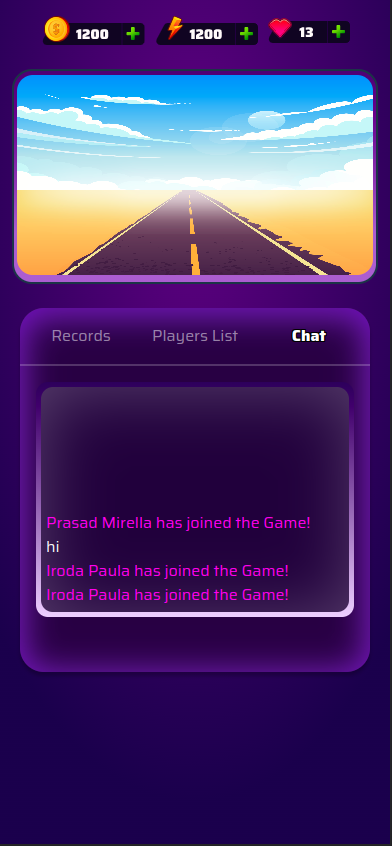
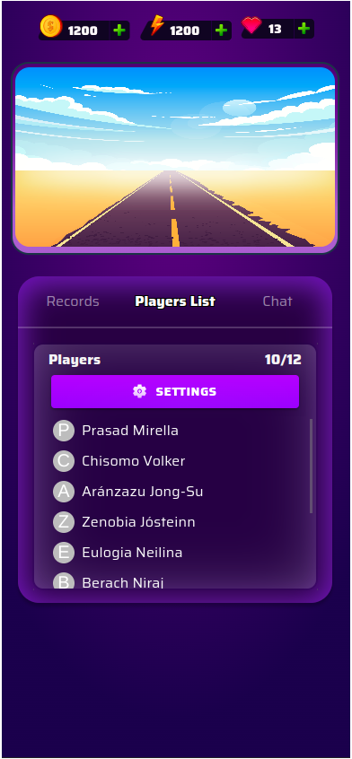
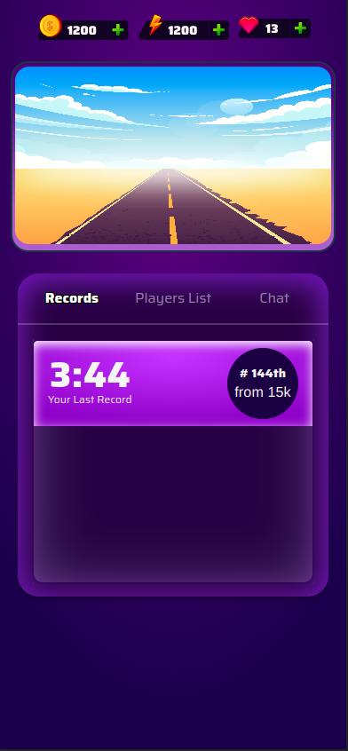

# About



# Configuration

Please make sure you have `.env` config file in the root project folder with the following content:

```
VITE_SOCKET_URL=<your socket server url>
```

# Setting up and running

Run the folowing commands:

```
npm install
npm run dev
```

then open http://localhost:5173/ in your browser
